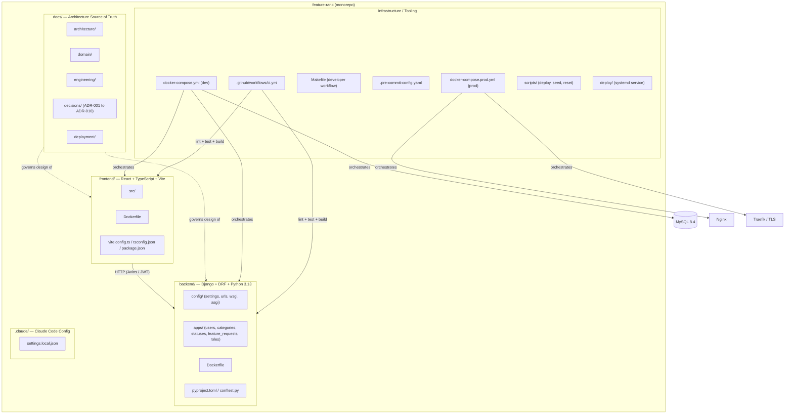
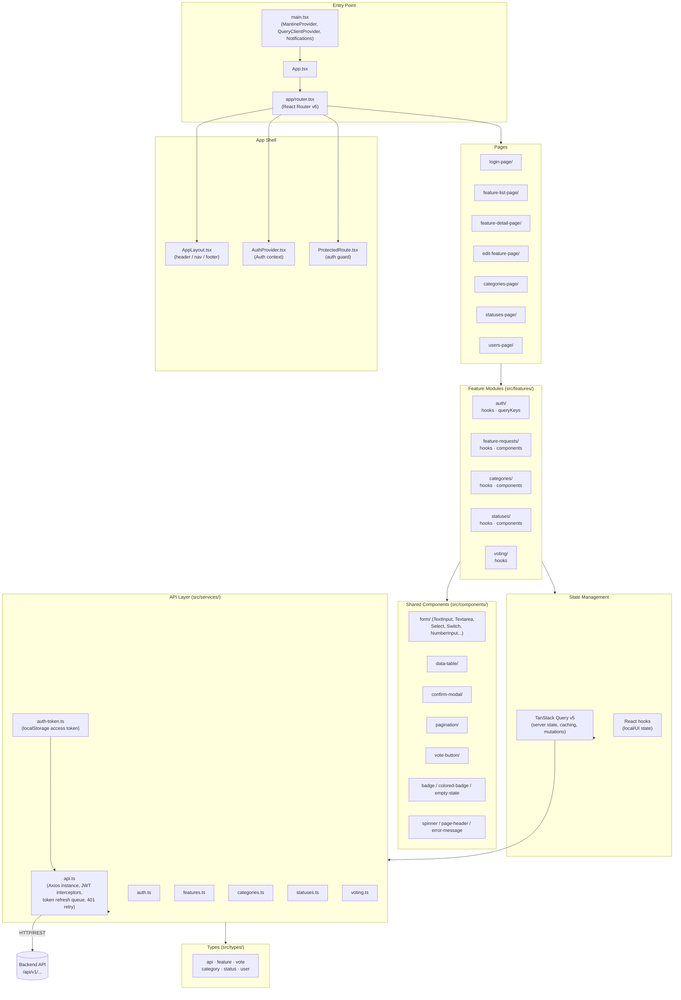
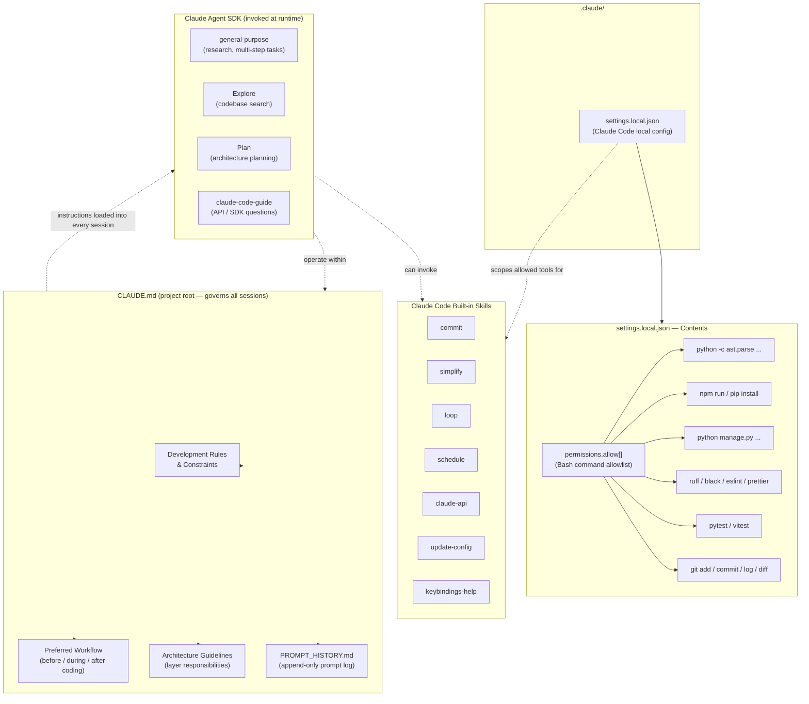

# Architecture Diagrams

> Generated on 2026-04-13. Based on actual repository structure and implementation.
> The technology stack was intentionally selected to align with the requirements and expectations of the target role.

---

# Monorepo Architecture

---

# Frontend Architecture

---

# Backend Architecture

```mermaid
graph TD
    subgraph HTTP_IN["HTTP Request"]
        CLIENT["Frontend / Client"]
    end

    subgraph ENTRY["Entry Points"]
        WSGI["wsgi.py / asgi.py"]
        ROOT_URL["config/urls.py\n(root router)"]
    end

    subgraph MIDDLEWARE["Middleware Stack"]
        CORS_MW["CorsMiddleware"]
        JWT_MW["JWTAuthentication (SimpleJWT)"]
        DRF_MW["DRF Middleware"]
    end

    subgraph VIEWS["Views Layer (HTTP I/O)"]
        V_AUTH["config/auth_views.py\nLoginView · TokenRefreshView · LogoutView\n(HttpOnly refresh cookie)"]
        V_USERS["apps/users/views.py\nRegisterView · MeView"]
        V_FEAT["apps/feature_requests/views.py\nFeatureRequestViewSet\n(list, create, retrieve, update, destroy, vote, unvote)"]
        V_CAT["apps/categories/views.py\nCategoryViewSet"]
        V_STAT["apps/statuses/views.py\nStatusViewSet"]
        V_HEALTH["config/views.py\nHealthCheckView"]
    end

    subgraph SERIALIZERS["Serializers Layer (Validation + Transformation)"]
        S_FEAT_R["FeatureRequestListSerializer\n(read, vote_count, has_voted)"]
        S_FEAT_W["FeatureRequestWriteSerializer\n(write, field protection)"]
        S_USER["UserRegistrationSerializer\nUserMeSerializer"]
        S_CAT["CategorySerializer / NestedCategorySerializer"]
        S_STAT["StatusSerializer / NestedStatusSerializer"]
    end

    subgraph PERMISSIONS["Permissions"]
        P_ADMIN["IsAdminUser"]
        P_AUTHOR["IsAuthorOrAdmin"]
        P_AUTH["IsAuthenticated"]
        P_ANY["AllowAny"]
    end

    subgraph SERVICES["Services Layer (Business Logic)"]
        SV_FEAT["feature_requests/services.py\ncreate · update · delete · vote · unvote\nstatus transition validation"]
        SV_USER["users/services.py\ncreate_user · update_user"]
        SV_CAT["categories/services.py\ncreate · update · delete"]
        SV_STAT["statuses/services.py\ncreate · update · delete"]
    end

    subgraph SELECTORS["Selectors Layer (Query Logic)"]
        SEL_FEAT["feature_requests/selectors.py\nget_feature_requests_list()\n• select_related (no N+1)\n• annotate vote_count (Count)\n• annotate has_voted (Exists)\n• filter by category/status/author/search\n• order: vote_count DESC → created_at DESC → id DESC"]
        SEL_USER["users/selectors.py\nget_user_by_email · get_user_list"]
        SEL_CAT["categories/selectors.py\nget_categories_list"]
        SEL_STAT["statuses/selectors.py\nget_statuses_list"]
    end

    subgraph MODELS["Models Layer (ORM + DB Constraints)"]
        M_USER["User\n(AbstractUser + name, email,\nis_admin, avatar_url)"]
        M_FEAT["FeatureRequest\n(title, description, rate 1-5,\nauthor FK, category FK, status FK,\ncreated_at, updated_at)"]
        M_VOTE["Vote\n(user FK, feature_request FK,\ncreated_at)\nunique_together: (user, feature_request)"]
        M_CAT["Category\n(name unique, icon, color,\ndescription, is_active)"]
        M_STAT["Status\n(name unique, color, is_terminal,\nis_active, sort_order unique)"]
    end

    subgraph INFRA_LAYER["Infrastructure"]
        DB[("MySQL 8.4\n(prod)\nSQLite (test/dev)")]
        RENDERER["drf_renderer.py\n(envelope response format)"]
        EXC_HANDLER["drf_exception_handler.py\n(standardized errors)"]
        PAGINATION["pagination.py\n(20 items/page)"]
    end

    CLIENT --> WSGI --> ROOT_URL
    ROOT_URL --> MIDDLEWARE
    MIDDLEWARE --> VIEWS
    VIEWS --> PERMISSIONS
    VIEWS --> SERIALIZERS
    SERIALIZERS --> SERVICES
    SERVICES --> SELECTORS
    SELECTORS --> MODELS
    MODELS --> DB
    VIEWS --> RENDERER --> CLIENT
    VIEWS --> EXC_HANDLER
    VIEWS --> PAGINATION
```

---

# .claude Folder Architecture

---

## Notes

### Stack Alignment with Target Role

The technology choices in this project were deliberate and matched to the role's requirements:

| Layer | Technology | Rationale |
|---|---|---|
| Frontend | React 18 + TypeScript + Vite | Modern SPA stack expected by the role |
| UI Library | Mantine | Component-complete, accessible, production-grade |
| Server State | TanStack Query v5 | Industry-standard async state management |
| Forms | React Hook Form | Performant, minimal-re-render form handling |
| Backend | Django + DRF | Python backend standard for the role |
| Auth | SimpleJWT with HttpOnly cookies | Secure token rotation pattern |
| Database | MySQL 8.4 | Production SQL database aligned with role expectations |
| Infra | Docker Compose + Nginx + Traefik | Containerized, TLS-ready production deployment |
| CI/CD | GitHub Actions | Standard pipeline tooling |
| AI Tooling | Claude Code + Agent SDK | Demonstrates AI-augmented development workflow |

### Architecture Decisions (ADRs)

Ten Architecture Decision Records (`docs/decisions/`) document every major structural choice:

- **ADR-001** — Monorepo structure
- **ADR-002** — Vote as a standalone entity with uniqueness constraint
- **ADR-004** — Layered backend: Views → Serializers → Services → Selectors → Models
- **ADR-005** — Frontend as a pure API consumer (no embedded business logic)
- **ADR-006** — JWT with 15-minute access tokens + 7-day rotating refresh via HttpOnly cookie
- **ADR-008** — Reference data (categories, statuses, roles) seeded and controlled, not freely created
- **ADR-010** — Makefile as single developer workflow interface
